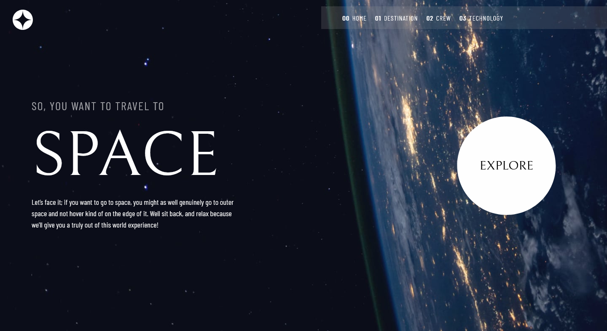

# Frontend Mentor - Space Tourism page solution

This is a solution to the [Space Tpurism page challenge on Frontend Mentor](https://www.frontendmentor.io/challenges/space-tourism-multipage-website-gRWj1URZ3/hub). Frontend Mentor challenges help you improve your coding skills by building realistic projects.

## Table of contents

- [Overview](#overview)
  - [Disclaimer](#disclaimer)
  - [The challenge](#the-challenge)
  - [Screenshot](#screenshot)
  - [Links](#links)
- [My process](#my-process)
  - [Built with](#built-with)
  - [Continued development](#continued-development)
- [Author](#author)

## Overview

### Disclaimer

This is still a work in progress so for now you will have a better experience viewing the site on a desktop screen

### The challenge

Users are able to:

- View each page and be able to toggle between the tabs to see new information
- Scroll through each item usign the mouse

### Screenshot

### Links

- Live Site URL: [Here](https://space-project-rho.vercel.app/destinations)

## My process

### Built with

- CSS custom properties
- Flexbox
- [ReactJS](https://react.dev/)
- [Bootstrap](https://getbootstrap.com/) - For styles and layout

### Continued development

I intend to add responsive functionality to the website making it easy to navigate in any screen size.

## Author

- Website - [Marcelo Oliveira](https://marcelooliveira.vercel.app/)
- LinkedIn - [Marcelo Oliveira](www.linkedin.com/in/marcelo-ferreira-de-oliveira)
- Github - [@heiderick13](https://github.com/heiderick13)
